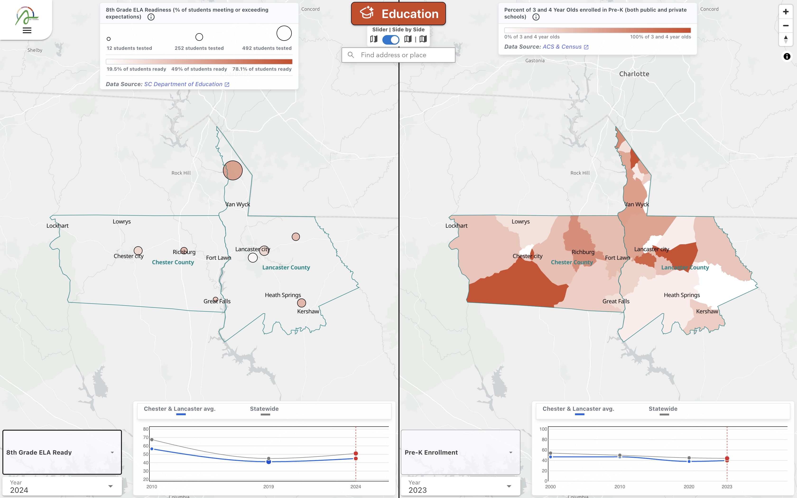
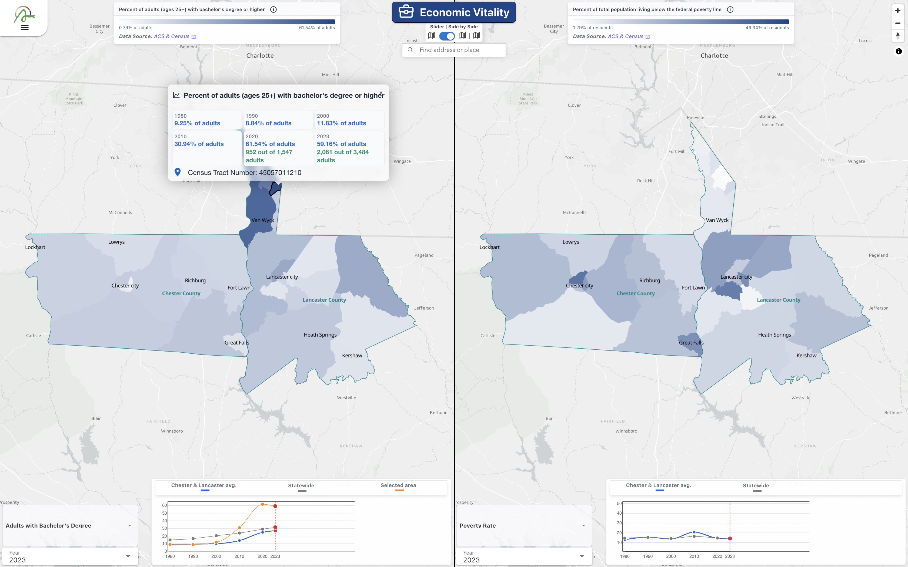
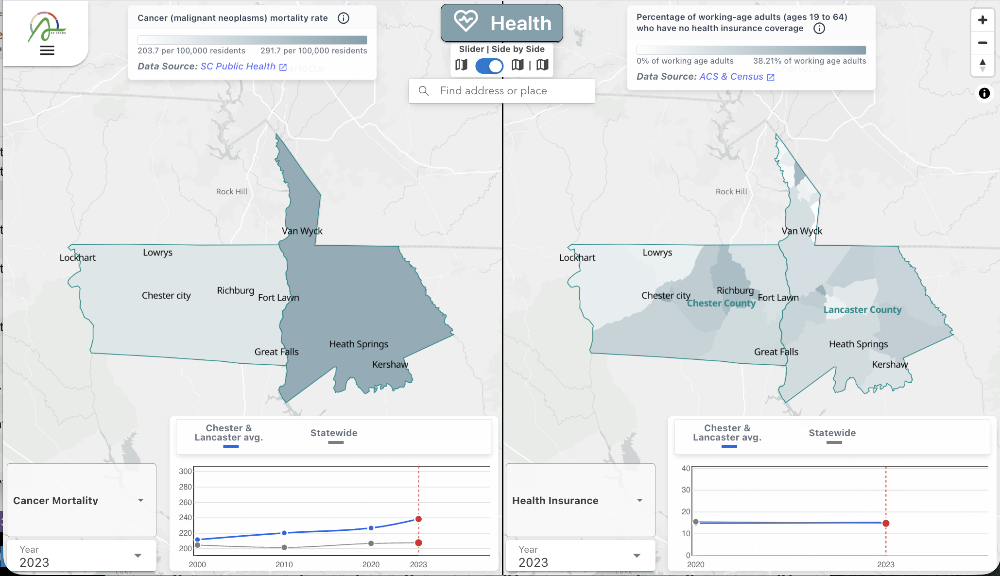

---
title:Community Health Indicator Dashboard
---

# Community Health Indicator Dashboard
#### With [North Arrow](https://www.north-arrow.org/) for [The Arras Foundation](https://arrasfoundation.org/)

<figure>
  
</figure>

I'm finally wrapping up the [Community Health Indicator Dashboard](https://arras.north-arrow.org/), my first project with [North Arrow](https://www.north-arrow.org/) - a GIS consultancy run by Olivia Ildefonso Ph.D, who I was fortunate enough to meet at CUNY, and her partner Charles Grosperrin. I had been aware of North Arrow for several years and excited to finally work with them to implement a custom dashboard for [The Arras Foundation](https://arrasfoundation.org/), a non-profit dedicated to the health and wellbeing of residents in Lancaster and Chester counties in South Carolina.

## The Brief
North Arrow and Arras had already discussed the project and its requirements before I was brought on to work on it. In many ways, the project followed nicely from what I had been doing at CUNY. 

The web based map presents 43 original, longitudinal datasets, organized into 5 themes--Economic Vitality, Education, Health, Natural Environment, and Social & Cultural Wellbeing. The split screen design allows the user to easily compare indicators. Crucially, the map needed to provide the ability to track the indicators over time.
## The New Bits (for me)
A few aspects of this project in particular presented me with new challenges I would need to solve that I hadn't encountered before - 
### Usability
- How do we present the 43 indicators across 5 themes without overwhelming the visitor? 
- How do visitors understand what the indicators show and what their limitations are?
- Will visitors see what kind of data exploration the site affords (in particular the timeline and comparison features?)

### Technical
- What is a clean and reliable way to compare two separate maps?
- How do we make sure the website performs well with so much data?

### Deployment and Maintenance
- How can we create a pipeline for updating the data that we can hand off to Arras to maintain on their own?
- Will current and future collaborators who may not be software developers be able to make the updates they need to make?

## Solutions
### Usability
Experience with similarly complex web maps provided me with many of the UI/UX solutions that we implemented. A landing page would provide a gentle introduction to the topics so that a visitor wouldn't be overwhelmed by complexity as soon as the page loads. The menus for selecting themes and indicators follow a hierarchy of importance and the timeline immediately responds to the mouse hovering to indicate that it is interactive.
### Technical
On the issue of comparing two maps, I had incidentally just released the [maplibre-gl-compare-plus plugin](https://github.com/Willjfield/maplibre-gl-compare-plus) which provides an easier way to implement both sliding between to maps and comparing two maps side by side. I was happy to put it into action.

Dealing with large amounts of data did not have a silver bullet solution. Ultimately it came down to loading data at the best points of interaction. With the data separated into themes, I was able to load all of one theme's data at once so that once the map is loaded, switching between indicators is almost instantaneous.
### Deployment and Maintenance
This was where I had to get creative. Most of the data was compiled from the Census and American Community Survey with a smattering of state data sources for things like education. While postgres is my go-to for most web mapping projects, this one had to be passed along and maintained independently by non-programmers with little or no experience managing databases. The simplest solution was to simply store the data as CSVs that could be stored and accessed from anywhere. Currently, they're saved as Google Docs but they could be accessed from anywhere that's exposed to the web. This made updating the data as simple as it can be.

In order to edit settings, I broke out everything possible into config files that can be directly edited and merged on github. New commits automatically trigger a build on github pages so that nobody needs to worry about deployment.

<figure>
  
</figure>
<figure>
  
</figure>
<figure>
  
</figure>

## Conclusion
The Community Health Indicator Dashboard is now live at [arras.north-arrow.org](https://arras.north-arrow.org/). It brings together decades of community health data into a single, explorable interface that Arras can use to track progress across Lancaster and Chester counties—and that they can maintain and update on their own. Working with North Arrow and Arras was a great opportunity to apply what I’ve learned from civic mapping at CUNY to a new context, while tackling fresh challenges around usability, performance, and handoff. I’m excited to see how the foundation and their partners put the dashboard to use.
