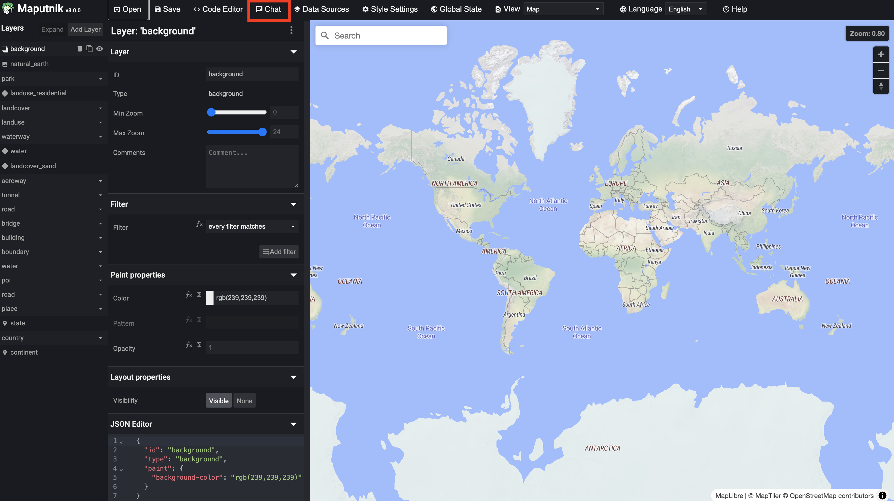
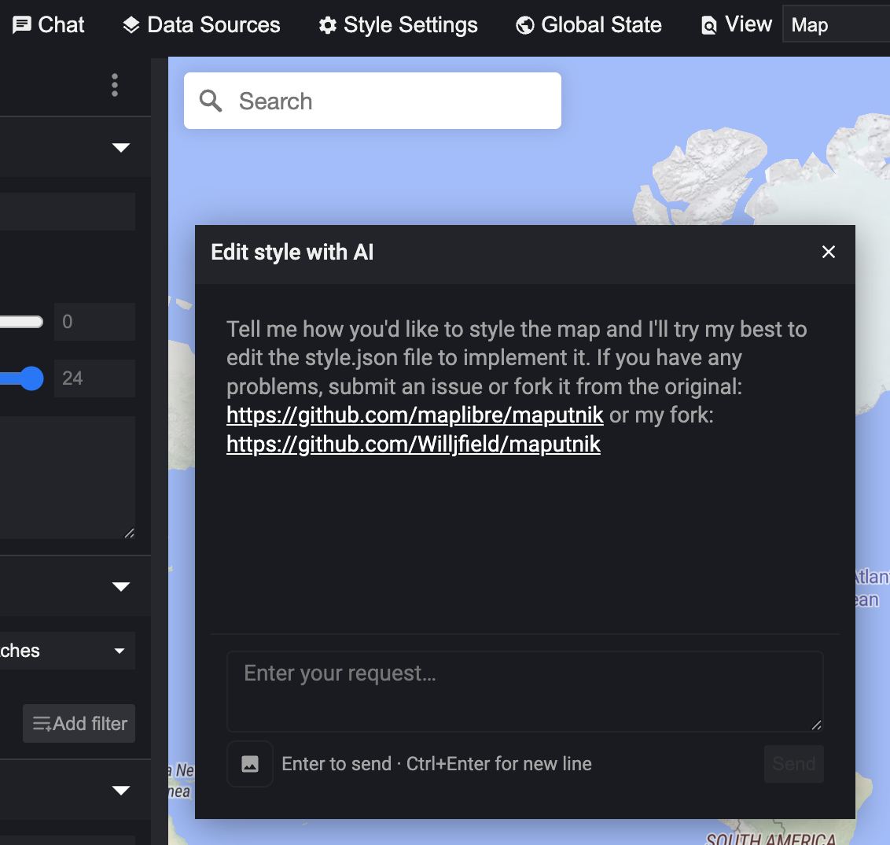
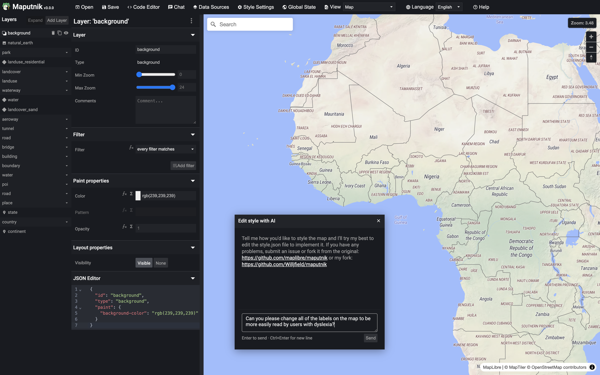
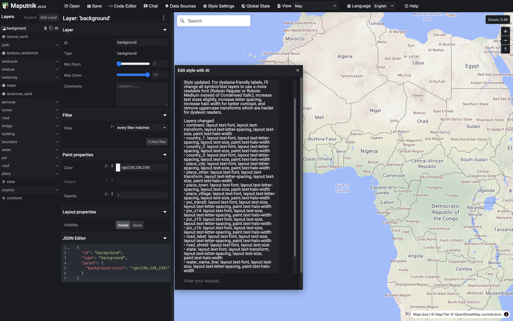
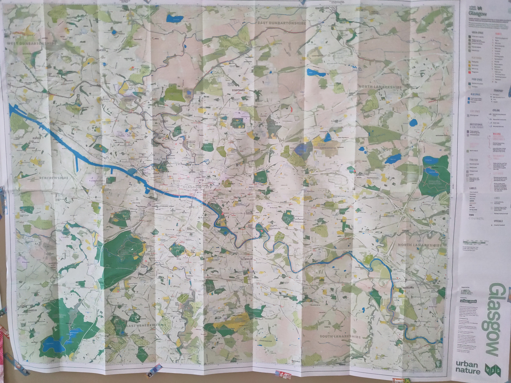
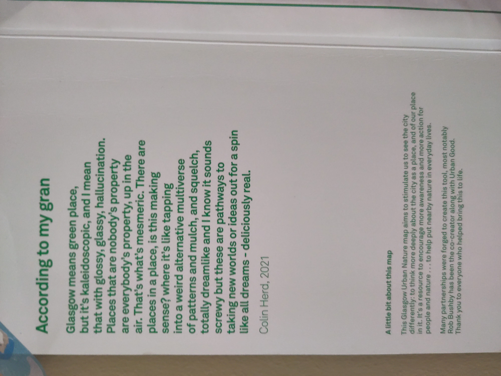
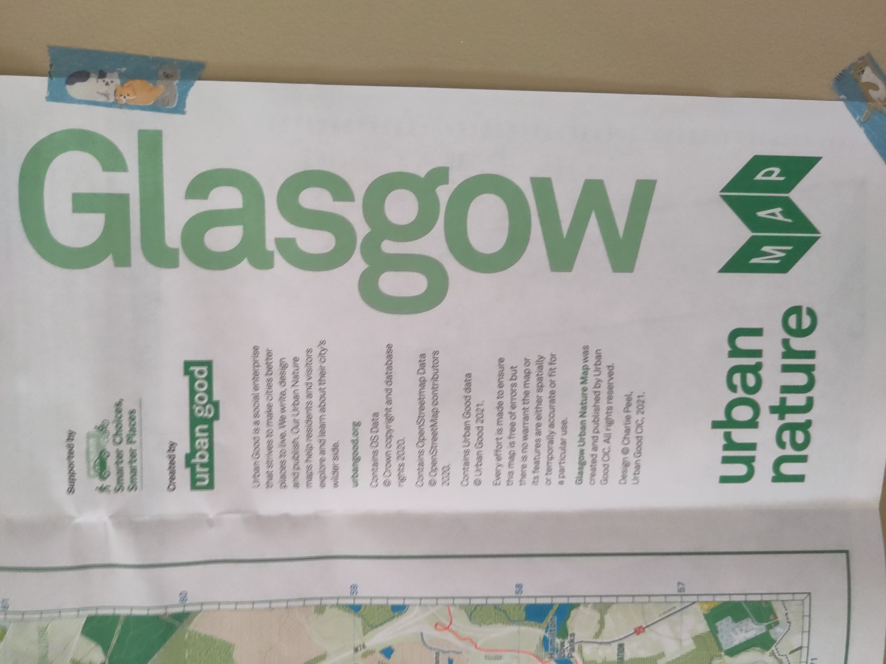
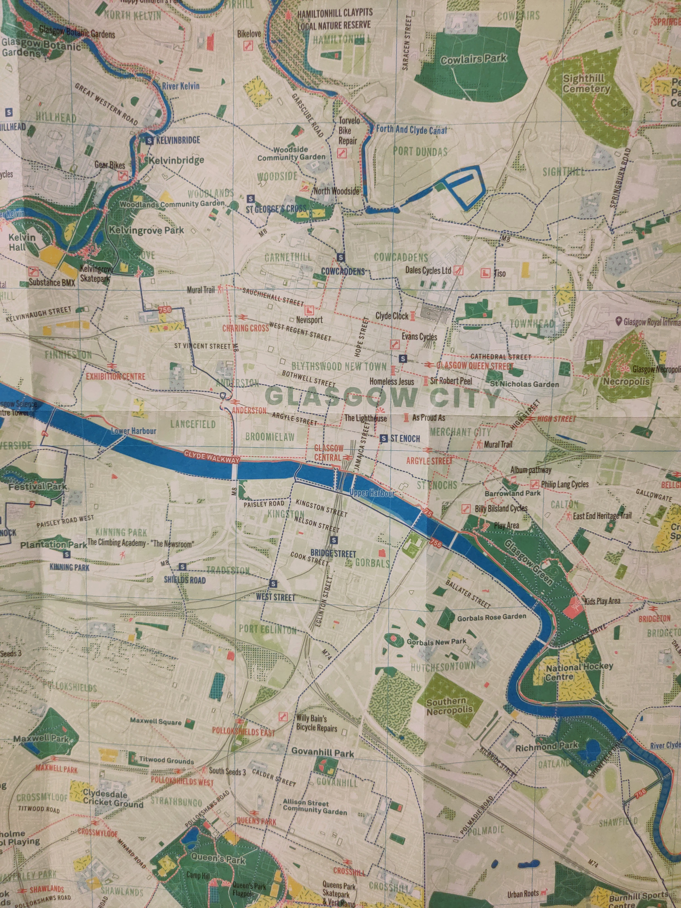

# Maputnik Style Editor

Not to be left in the dust on AI but cautious to burn tokens (and Co2) just for novelty's sake, it took me some time to come around to an AI project I felt was worth pursuing. Of course as a designer and programmer who works with web mapping and likes building tools for others to work with, it shouldn't have taken so long to look at Maputnik which was staring at me the whole time.

Maputnik is a free, open-source visual editor for MapLibre GL styles, aimed at developers and map designers.
It’s the style editor used at maplibre.org/maputnik, built with React and TypeScript on top of MapLibre GL JS, and supports the full MapLibre style spec (layers, sources, paint, layout, etc.) through a UI and, more recently, through a full-style code editor and a natural-language style chat.

# But why does it need a chat interface?

Accessibility is too often seen a "nice to have" by clients, developers, and designers. Of course, it's very rare (in my experience) to run into head winds that oppose implementing accessibility features, it's also rare for a project to get the tail winds needed to actually move accessibility forward.

When approaching accessibility in any design project I've worked on, the first challenge is to find accessibility guidelines to follow which are relevant. General web accessibility guidelines are not _too_ difficult to find but mapping guidelines are few, far between, and often incomplete. The second challenge is to translate these guidelines to fit your particular project and only then can you actually implement them.

So my hope is that this chat interface will jump start the process. In theory, an agent can lower this bar by accessing and analyzing accessibility guidelines while simultaneously implementing them. Crucially, I ensure that it would explain exactly what it had changed based on your prompt and why it made those changes.

# So what did I actually do?

When the experimental version of Maputnik loads, I've added an additional "chat" button to the top row of controls.

<figure>
  
    <figcaption style="font-size:.8em; line-height: 1em;">Maputnik map editor with the new Chat button outlined in red</figcaption>
</figure>

This brings up a chat window prompting the user to edit the map style. Along with a button to upload images that can be referenced with the text prompt. 

<figure>
  
      <figcaption style="font-size:.8em; line-height: 1em;">The prompt window and button</figcaption>
</figure>

## Text Prompts
My first task was to see what would happen if I send the style.json file along with an editing prompt to Anthropic's API. The answer was encouraging - it returned what looked like valid style json. But the API response took over 3 minutes to return, burned through tokens, money, probably electricity, and included natural language in addition to the json.

So I was able to cut time dramatically by having the API return only the patched layers rather than the entire contents of the style.json and the problem was solved. Now, the issue is that it made changes but I had no way of knowing exactly what they were other than trying to look through every single layer.

This is where I used my Cursor agent (btw, I use Cursor to code), to engineer a prompt for the Anthropic agent that would get a responses that include not only a list of the json patches made but an explanation of why it decided to make them.

 
I started testing my idea by looking at labels. I prompted the agent to "change all of the labels to be more easily read by users with dyslexia."

 
The response was very encouraging. I was told exactly what properties on which layers were changed and **crucially** got an explanation as to why it made these changes:

 "For dyslexia-friendly labels, I'll change all symbol/text layers to use a more readable font (Roboto Regular or Roboto Medium instead of Condensed Italic), increase text sizes slightly,  increase letter spacing, increase halo width for better contrast, and remove uppercase transforms which are harder for dyslexic readers."
 

## Images
I tested the image upload functionality by loading the <a href="https://github.com/maputnik/osm-liberty">OSM Liberty Style</a>, uploading a photograph of a (wonderful) physical map of Glasgow's natural spaces by Urban Good hanging in the map corner of my living room. The map is available, along with maps of natural spaces in other UK cities at <a href="https://www.urbangood.org/collections/folded-maps">on Urban Good store</a>

<figure>
  

</figure>
<table>
<tbody>
<tr>
<td>
<figure>
  
  </figure>
</td>
<td>
  <figure>
      
  </figure>
  </td>
  </tr>
  </tbody>
  </table>
And I was, frankly, sufficiently surprised by the results after just a single prompt that the ethical implications worried me. Though not breaking any copyright laws I'm aware of and not making money from it, I certainly felt compelled to properly credit the original style's creators (above) and point visitors to their shop. (I also hope to the update this post after I reach out to the creators to get their feedback.)
<figure>
  
    <figcaption style="font-size:.8em; line-height: 1em;">A quick snap shot I uploaded from my phone with a prompt to recreate the colors, labels, fonts etc. as closely as possible.</figcaption>
</figure>
<table>
<tbody>
<tr>
<td>
<figure>
  
      <figcaption style="font-size:.8em; line-height: 1em;">Original OSM Liberty map style</figcaption>
  </figure>
</td>
<td>
  <figure>
      
       <figcaption style="font-size:.8em; line-height: 1em;">The OSM style after prompted to try matching Urban Good's Natural Spaces style from a photograph</figcaption>
  </figure>
  </td>
  </tr>
  </tbody>
  </table>