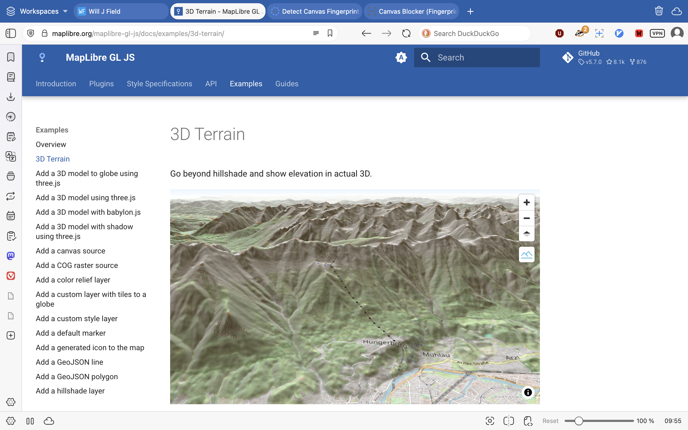
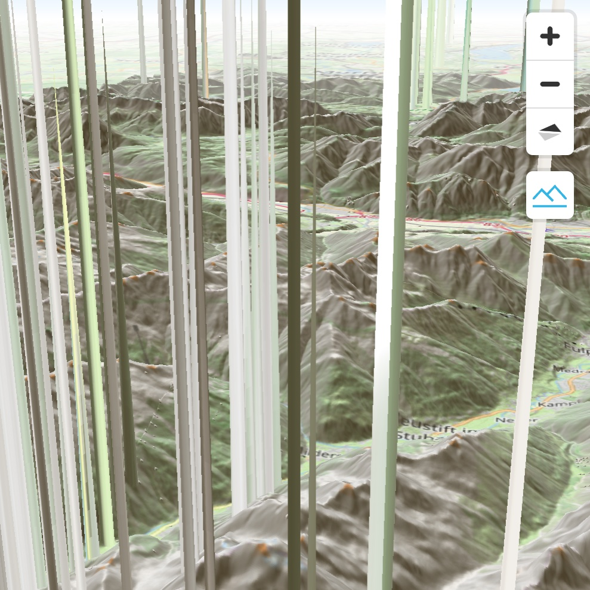

# Anti-Browser Fingerprinting Revealed on the Map

Where maps, computer graphics, and online privacy meet I discovered one of the more interesting rabbit holes that I've had the pleasure of following. It started while I was working on my portfolio and noticed a strange phenomenon that I could only bring about on the [duckduckgo android browser](https://duckduckgo.com/duckduckgo-help-pages/mobile/android) on my phone. Specifically, small white circles would appear randomly on the map:

<table>
<tbody>
<tr>
<td>
<figure>
  
  <figcaption style="font-size:.8em; line-height: 1em; margin-top:1rem;">The background appears with no glitches on desktop and most mobile browsers</figcaption>
</figure>
</td>
<td>
<figure>
  
  <figcaption style="font-size:.8em; line-height: 1em;margin-top:1rem;">But on android, small white circles appeared around the edges.</figcaption>
</figure>
</td>
</tr>
</tbody>
</table>

## But Why?

My first thought was that there must be point features that for whatever reason are being rendered in one environment but not in the other. I quickly noticed, however that they would appear in different places each time. This was the first sign that there was something else going on. I next went to the [MapLibreGLJS examples page](https://maplibre.org/maplibre-gl-js/docs/examples/3d-terrain/) to see if there was something wrong with the data, my code, or perhaps something else. Sure enough, I discovered that the 3D terrain rendered perfectly well on most browsers but not on duckduckgo for Android.

<table>
<tbody>
<tr>
<td>
<figure>
  
  <figcaption style="font-size:.8em; line-height: 1em; margin-top:1rem;">The background appears with no glitches again on desktop and most mobile browsers</figcaption>
</figure>
</td>
<td>
<figure>
  
  <figcaption style="font-size:.8em; line-height: 1em;margin-top:1rem;">But on android, the terrain randomly shot straight up into the air... weird.</figcaption>
</figure>
</td>
</tr>
</tbody>
</table>

## Ok, so now what?

Luckily, there's an excellent MaplibreGLJS Slack channel I'm on where I could ask what might be going on. It turns out that this was a known issue. One maintainer immediately recognized it as artifacts from anti-fingerprinting techniques used in some browsers. This is when things got really interesting. 

Basically, some trackers on websites will draw text or graphics to a webgl canvas, sometimes imperceptibly, then read the pixels, and use small rendering differences (fonts, GPU, OS) to build a stable unique user identifier.

A common trick to disrupt this invasion of privacy is to add noise when JavaScript reads pixel data back from a canvas (e.g. via getImageData()). By perturbing those read-back values, the browser makes the fingerprint less stable and less useful for tracking.

That same mechanism can break apps that use the canvas only as a data pipeline, not for fingerprinting. MapLibre GL JS (and similar WebGL map engines) need raw pixel values from elevation tiles (DEMs delivered as PNGs). To decode them, the library draws each tile image into a 2D canvas and then calls getImageData() to get the RGB values that encode height.

The “elevation” values are then wrong in random places, so the 3D terrain is built from corrupted data and you see glitches: spikes, holes, or odd patches, even though the original tile images are unchanged.

## Fix?

I'm sure there's some sort of metaphor or art project to be made investigating the representation of randomized distortion in an actual physical location as a practical means of preserving privacy but I will leave that for another day. How could this be fixed and is it worth fixing?

My initial thought was to simply discard elevation data, perhaps optionally, if it appeared as a spike above a certain threshold from neighboring areas. This may be the simplest solution and, I believe, would maintain the privacy preserving features. Another solution, suggested by a maintainer, was to rethink the underlying encoding of digital elevation data to avoid reading pixels from a canvas. This would nip the issue in the bud but would be a very involved process to solve a very niche issue.

Ultimately, the consensus was that this was a very low priority issue since it appears on so few browsers. So if you want, you can get duckduckgo for android and see it for yourself. Interestingly, despite trying numerous anti-fingerprinting add-ons and extensions for numerous browsers, I was unable to reproduce the issue on desktop. 
