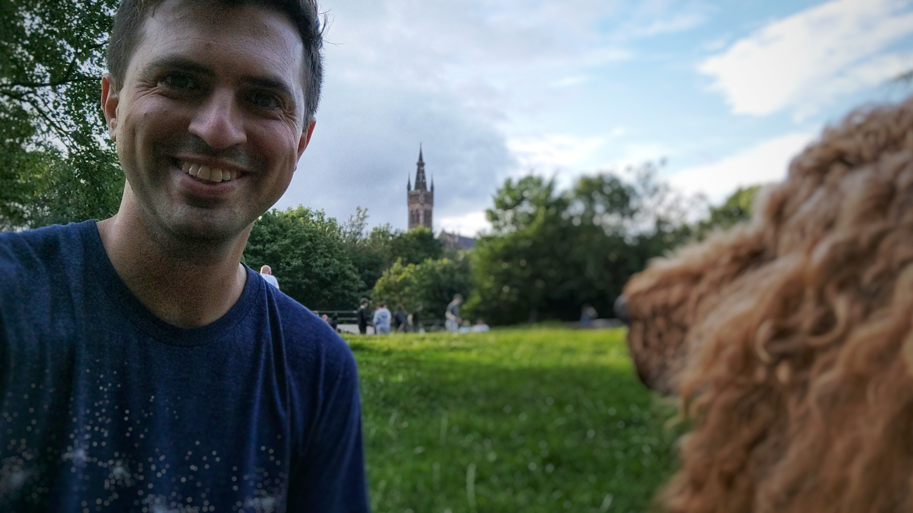

# Making An Animated 3D Background For My Portfolio With MapLibre GL JS

## Earlier this month I moved to Glasgow, Scotland with my wife, child, dog, and two cats.



After 7 years at the CUNY Graduate Center working with Steve Romalewski on civic maps, I'm stepping back out into a job market in Scotland that's very different than the one in the US in 2017. To prepare for the new job search, I updated my portfolio website and, taking advantage of my new found underemployment, started this blog to document and share my professional and personal projects. To that end, I wanted to write about the main additions I made - the 3D visualization for the background of the portfolio and the vitepress powered blog.

## The Idea

A good portfolio site, like a resume, needs to stand out from the others while not being gimmicky or distracting from the content. After overhauling my portfolio to a Vite/VueJS stack I wanted to add something interesting to the clean, minimalist design that would make it stand out without distracting from the content. I settled on the concept of using some kind of map as a background. I liked sites I'd seen that use a parallax effect for the background but wanted to take it a step further with a fully 3D terrain fly-through.

## The Data

Elevation data is surprisingly easy to work with, at least for simple projects like this. But first I had to find a Digital Elevation Model (DEM) to use. So fortunately, [the DEM tiles made years ago by terrarium](https://github.com/mapzen/terrarium) is still accessible on AWS. The source can be added to the style json file following the example in the [maplibregl js docs](https://maplibre.org/maplibre-gl-js/docs/examples/3d-terrain/)

::: code-group

```js [style.json]
"sources": {
    ...,
    "terrainSource": {
      "type": "raster-dem",
      "encoding": "terrarium",
      "maxzoom": 15,
      "tiles": [
        "https://s3.amazonaws.com/elevation-tiles-prod/terrarium/{z}/{x}/{y}.png"
      ]
    }
  },
  "terrain": {
    "source": "terrainSource",
    "exaggeration": 2
  },
```

:::

## Setting Up The Scene

The project brought me back to the 3D work I used to do more of and still enjoy very much. There's a long theoretical article to be written one day about the cognitive and perceptual differences between working with "maps" as opposed to "scenes." Once a camera's 3D transformations become integral to the display of space, the work seems to become more of a digital twin than a data visualization. 

<figure>
  
  <figcaption style="font-size:.8em; line-height: 1em;">Simou, Eirini & Nomikou, Paraskevi & Lykousis, V. & Papanikolaou, D. & Vassilakis, Emmanuel. (2014). Coastal hazard related to landslide distribution derived from morphotectonic analysis (SW Gulf of Corinth, Greece). </figcaption>
</figure>

The final step was determining where the camera should fly through. I chose rivers, valleys, and streams near places I've lived and created simple geojson paths through them on [geojson.io](https://geojson.io/)


## Camera Animation

Somewhat surprisingly, the camera animations built into maplibregl-js are not very robust. They provide only a flyTo([position]) function with some parameters for animation movement. To actually follow an arbitrary line, I had to write a method (with an AI assist and help from turf.js) to interpolate the position of the camera given the set of coordinates in the geojson file. The script below returns a function that takes a single parameter describing the amount of completion between 0-1 and returns a latitude/longitude.

::: code-group

```js [interpolateLine.js]
import { lineString, length as turfLength, along as turfAlong } from '@turf/turf';

/**
 * Given an array of [lng, lat] coordinates, returns an interpolator for the line.
 * @param {Array<[number, number]>} coordinates - The LineString coordinates.
 * @returns {{ totalLength: number, interpolate: (t: number) => [number, number] }}
 */
export function createLineInterpolator(coordinates) {
  const line = lineString(coordinates);
  const totalLength = turfLength(line, { units: 'kilometers' });

  /**
   * Get the interpolated point at completion t (0=start, 1=end).
   * @param {number} t - Completion (0=start, 1=end)
   * @returns {[number, number]} - [lng, lat]
   */
  function interpolate(t) {
    const dist = t * totalLength;
    const pt = turfAlong(line, dist, { units: 'kilometers' });
    return pt.geometry.coordinates;
  }

  return { totalLength, interpolate };
} 

```

:::

The problem with relying only on this is that the camera movement is jerky when it reaches each point in the line. To solve this, I interpolated the line at 3 different completion amounts. The rotation angle of the camera is calculated from the vector from the slightly before and slightly after the camera's current position. Depending on how far apart those two points are from the current position, the smoother the rotation will be.

::: code-group

```js [interpolateLine.js]
 scrollEventHandler() {

      let completion = (window.scrollY * this.animationSpeed) / document.body.offsetHeight;
      completion += this.autoAnimation;
      if (window.scrollY > 5) {
        this.$refs.downArrowPrompt.style.display = 'none';
      }
      if (window.scrollY / window.innerHeight > 0.667 || this.modalOpen) {
        this.hideSelectRiver = true;
      } else {
        this.hideSelectRiver = false;
      }
      // Clamp completion between 0 and 1
      completion = Math.max(0, Math.min(1, completion));
      const [lng, lat] = this.interpolator.interpolate(completion);

      // Compute direction for bearing
      let tNext = completion + interpolationSmoothing;
      tNext = Math.max(0, Math.min(1, tNext));
      const [lng2, lat2] = this.interpolator.interpolate(tNext);

      let tPrev = completion - interpolationSmoothing;
      tPrev = Math.max(0, Math.min(1, tPrev));
      const [lng1, lat1] = this.interpolator.interpolate(tPrev);

      // Compute direction for bearing
      const deltaLng = lng2 - lng1;
      const deltaLat = lat2 - lat1;
      // atan2 for compass bearing: x=deltaLng, y=deltaLat
      let angleRad = Math.atan2(deltaLng, deltaLat);
      let angleDeg = (angleRad * (180 / Math.PI)) + 180;
      if (!this.displayMap) {
        console.log("not displaying map")
        return;
      }
      this.map.flyTo({
        essential: true,
        center: [lng, lat],
        bearing: angleDeg,
        animate: false,
        duration: 500
      });
    },
```

:::

Finally I had to spend a lot of time tweaking the parameters to make the motion just right and style the lines.

<video controls>
  <source src="./assets/final_screenshot.mp4" type="video/mp4" />
  Your browser does not support the video tag.
</video>
